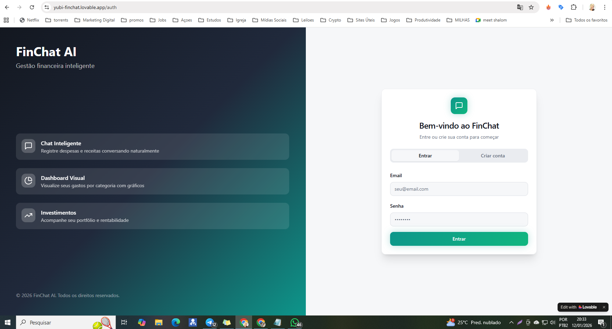
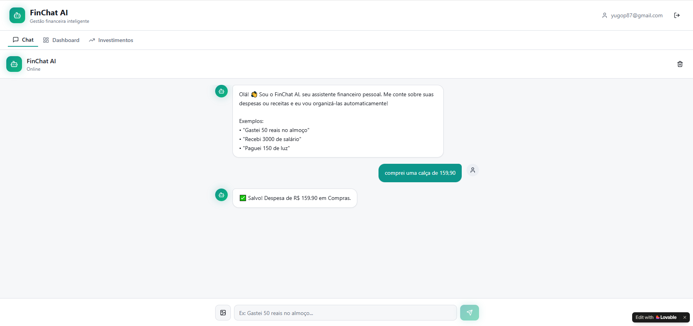
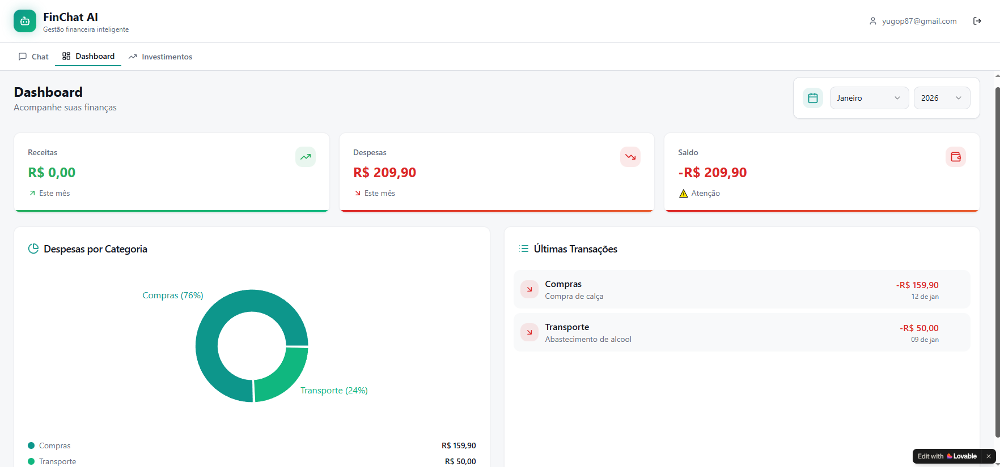

    🚀 <strong>Acesse o MVP Online:</strong> <a href="https://yubi-finchat.lovable.app/">https://yubi-finchat.lovable.app/</a>

# 💸 FinChat AI - Gestão Financeira com Vibe Coding

> ℹ️ **NOTE:** Este é o repositório desenvolvido durante o desafio de Vibe Coding do **Bootcamp Caixa - IA Generativa** na **DIO**. O objetivo foi criar uma aplicação Fullstack sem escrever código manualmente, utilizando IA Generativa como parceira de desenvolvimento.

O projeto consiste em um **Gerenciador Financeiro Inteligente** que permite registrar gastos via chat (texto e voz) e interpreta fotos de recibos usando Visão Computacional, eliminando a complexidade das planilhas manuais.

## 💻 Tecnologias utilizadas no projeto

- [Lovable.dev](https://lovable.dev/) - Motor de geração de código (React/Vite)
- [Supabase](https://supabase.com/) - Banco de Dados e Autenticação
- [Google Gemini](https://ai.google.dev/) - IA Multimodal para interpretar textos e imagens
- [Shadcn UI](https://ui.shadcn.com/) - Componentes visuais modernos

## ✨ Como foi feito?

- **Frontend:** Gerado via prompt One-Shot no Lovable (React + Tailwind).
- **Backend:** Banco de dados SQL criado automaticamente pelo Lovable no Supabase.
- **Inteligência:** Integração com API do Google Gemini (`gemini-1.5-flash`) para ler textos e imagens.
- **Correção de Fluxo:** Ajuste de prompts para garantir o parsing correto de respostas JSON da IA.

## 📚 Materiais

- [Prompt (PRD) Utilizado](./PRD.md)
- [Link do App Publicado](https://yubi-finchat.lovable.app/)
- [Google AI Studio (Gerar Chaves)](https://aistudio.google.com/)

## 🛠️ Instruções de execução

Siga o passo a passo abaixo para reproduzir este projeto:

- 🤖 1. Copie o **PRD** (Product Requirements Document) disponível na descrição deste projeto.
- 🤖 2. Acesse o **Lovable.dev** e cole o PRD no chat inicial.
- 🤖 3. Conecte sua conta do **Supabase** quando a plataforma solicitar para criar o Banco de Dados.
- 🤖 4. Insira sua `VITE_GOOGLE_API_KEY` nas configurações de "Secrets" do projeto.

## 📸 Screenshots

  
  

## 👨‍💻 Expert

    
    
&nbsp&nbsp&nbspYugo Pereira 
    &nbsp&nbsp&nbsp
    <a href="https://github.com/yugopereira">
        GitHub
    </a>
    &nbsp;|&nbsp;
    <a href="https://www.linkedin.com/in/yugopereira">
        LinkedIn
    </a>
    &nbsp;|&nbsp;
    <a href="https://www.instagram.com/yugopereira/">
        Instagram
    </a>
    

  

  Desenvolvido com 💜 durante o Bootcamp Caixa - IA Generativa da DIO

    ⌨️ com 💜 por <a href="https://github.com/YugoPereira">Yugo Pereira</a>

